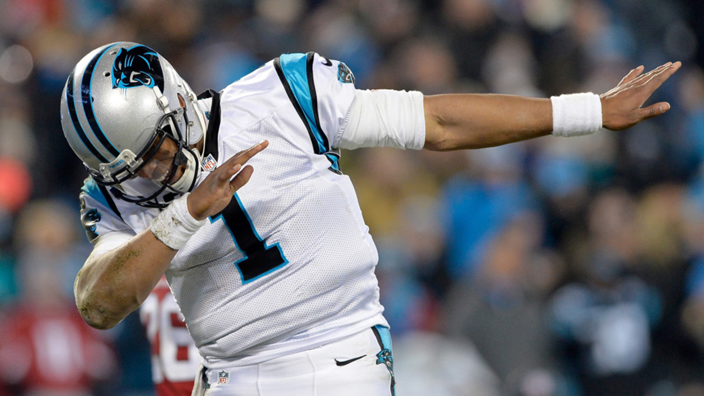
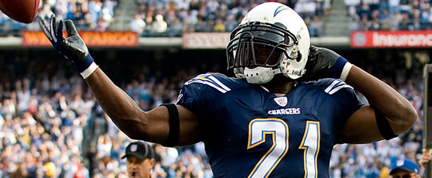
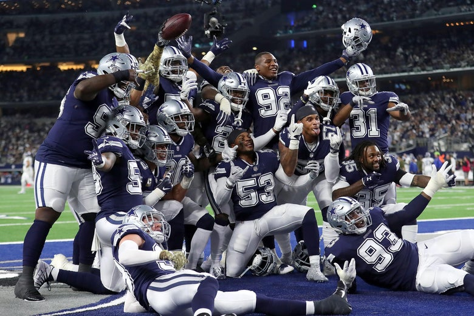
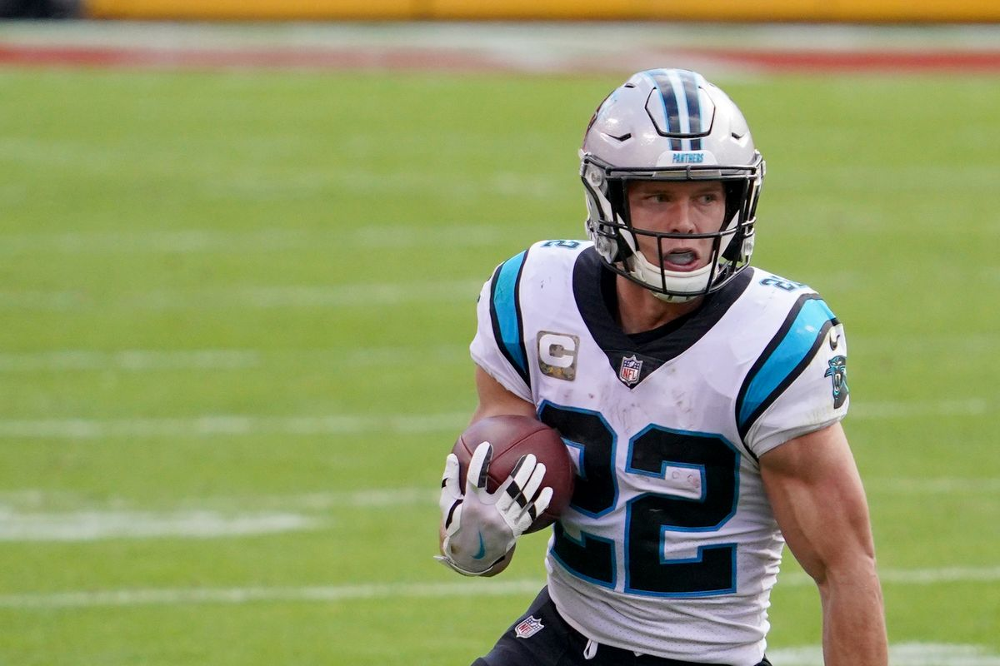
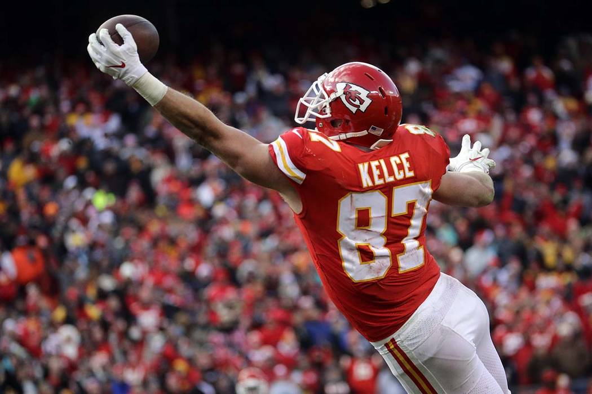
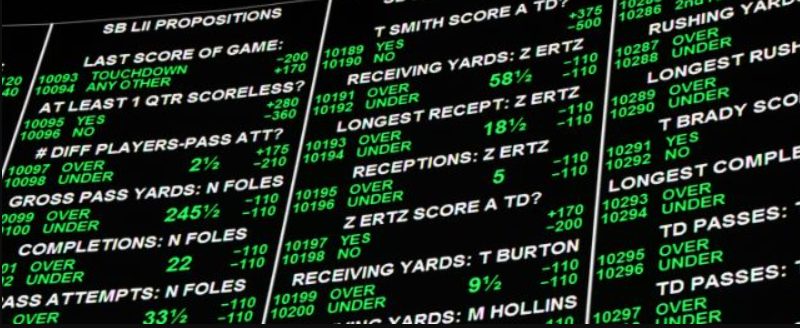

<style type="text/css">

h1.title {
  font-size: 48px;
  color: #A52A2A;
  text-align: center;
}
h4.author { 
  font-size: 24px;
  color: DarkBlue;
  text-align: center;
}
h4.date { 
  font-size: 24px;
  color: DarkBlue;
  text-align: center;
}
 .tocify ul, .tocify li {
    line-height: 30px;
}

h1, h2, h3 {
  text-align: center;
  font_size: 60px;
  font-weight: bold;
}

body {
    font-size: 24px;
}
</style>

```{r, echo = FALSE, message=FALSE}
### Loaded Packages
library(tidyverse)
library(knitr)
library(modelr)
library(splines)
xfun::pkg_load2(c("htmltools", "mime"))
```

```{r, echo = FALSE, message=FALSE, warning = FALSE}
### Loaded Packages
source("data_collection.R")
source("data_cleaning.R")
source("missing_values_EDA.R")
source("Overall_rankings_EDA.R")
source("Main_EDA.R")
```

```{r, echo = FALSE, out.extra='style="padding:10px; display: inline-block;"'}

```


## What is Fantasy Football?  


Fantasy football has been around since the 1960s (much before I was alive) and has impacted the lives of numerous NFL fans, sports analysts, and sports betters nationwide.  It was not until 1997 where fantasy football really increased in popularity due to its easy accessibility online. For those not familiar with the concept of fantasy football, here it is in a nutshell: you draft a team of real NFL players to fill your roster spots, which are generally represented with different NFL offensive positions, and you gain points each week based on how well these NFL players perform in-game. Your goal is to win your respective league, whether it is with your family, friends, or to win money.
  	
What many fantasy enthusiasts fail to recognize is that there is a myriad of statistics and data available to evaluate performances of NFL players, assess possible trends in fantasy production, develop winning strategies, or maybe just learn more about how the game has changed over the years. Thankfully, you are in luck. Throughout my report I will present you with some interesting statistical information using exploratory data analysis with R (programming language). This will be done in the form of data transformation techniques, 2D visualization plots, linear modeling, measures of average and spread, and summary ranking tables. Hopefully, you will be one step closer to pursuing your fantasy football aspirations or, at the very least, you will walk away with some fascinating facts that you never knew before. 


## Source of Data 


It is important to note that all data I will be working with is from Pro Football Reference (https://www.pro-football-reference.com/years/). I imported the raw data into RStudio and did my own data collection and cleaning before analysis. Here are two downloadable files of the tidied dataset and the related codebook that you can use as a reference for the data variables. 
<br><br>

Tidied Dataset: 

```{r, echo=FALSE}
xfun::embed_file('data/processed/complete_ff_data.xlsx')
```
<br><br>

Codebook: 

```{r, echo=FALSE}
xfun::embed_file('data/processed/ff_rankings_codebook.txt')
```


## Missing Data


The tidied dataset includes missing values for critical categories such as yards per attempt (y_a), yards per reception (y_r), fumbles lost (fl), value-based drafting (vbd), and overall rank (ov_rank). Value-based drafting score and overall rank are values determined based on performance relative to other players, so a missing value would indicate that the player is outside the defined ranking. For yards per attempt, yards per reception, and fumbles lost, I did some plotting and confirmed that the missing values are for players that did not record a single attempt, reception, or fumble during the season. 

**Summary of types of values and missing values in the dataset:** 
```{r, echo=FALSE, fig.align="center"}
vis_dat(complete_ff_data)
vis_miss(complete_ff_data)
```

**Plotting missing values for yards per reception and yards per carry:** 

```{r, echo=FALSE, fig.align="center"}
#Plotting NA patterns in data for y_a and y_r for each position
ggplot(complete_ff_data, 
       aes(x = y_r, 
           y = y_a)) + 
  geom_miss_point() +
  facet_wrap(~fant_pos) + 
  theme_dark() +
    labs(
       x = "Yards Per Reception",
       y = "Yards Per Rushing Attempt")
```

**Plotting fumbles in general (including lost and recovered fumbles) vs fumbles being lost.** 

```{r, echo=FALSE, fig.align="center"}
#Plotting fumbles (both lost and recovered) and fumbles lost to explain why there is NA values
complete_ff_data %>% 
  filter(!is.na(fant_pos)) %>% 
  ggplot(aes(x = fmb, 
           y = fl)) + 
    geom_miss_point(jitter = 1) + 
    facet_wrap(~fant_pos) + 
    theme_dark() + 
    labs(
       x = "Total Fumbles (Recovered and Lost)",
       y = "Fumbles Lost")
```

As you can see, a player can have multiple fumbles but recover them all and record no fumbles being lost as a missing value. 


## Who's the Best?

<br><br>

```{r, echo = FALSE, fig.align="center"}

```

<br><br>
**Note: All rankings are calculated using standard fantasy scoring unless otherwise stated.** 
<br><br>

It is essential to acknowledge that there are a variety of methods in determining rankings for NFL players with regards to their fantasy performance. In my analysis, I ranked fantasy players at each position over the last two decades (2000 - 2019), based on two main criteria: average career fantasy points per game and most top ten season finishes. The averages were taken from seasonal data rather than data for each individual game due to convenience and simple reproducibility; however, I also included boxplots for each of the top players to visualize the measure of spread over their career. The requirements for these rankings included rushing and receiving players that had to have played at least 50 games in their career and quarterbacks that have played at least 100 games in their career. Also, I only included seasons in which the player had played at least half the season to account for injury risk. 


```{r, echo = FALSE}
#Best Career Averages for QBs

best_career_avgs %>% 
  filter(fant_pos == "QB", tot_games >= 100) %>% 
  head(10) %>% 
  ggplot(aes(x = reorder(player, career_avg_fp), y = career_avg_fp)) + 
    geom_bar(stat="identity", width=.5, fill="tomato3") +
    coord_flip() +
    labs(title = "Top 10 QB Career Average Points Per Game",
       x = "Player",
       y = "Average Fantasy Points Per Game")

box_plot_data %>% 
  filter(fant_pos == "QB", tot_games >= 100) %>% 
  select(player, year, avg_ff_yr) %>% 
  head(125) %>% 
  ggplot(aes(x = fct_rev(player), y = avg_ff_yr)) + 
  geom_boxplot(aes(group = player)) +
  geom_jitter() +
  coord_flip() +
  labs(x = "Player",
       y = "Average Fantasy Points Per Game")
```

```{r, echo = FALSE}
best_career_avgs %>% 
  filter(fant_pos == "QB", tot_games >= 100) %>% 
  head(10) %>% 
  data.frame
```


```{r, echo = FALSE}
#Best Career Averages for RBs

best_career_avgs %>% 
  filter(fant_pos == "RB", tot_games >= 50) %>% 
  head(25) %>% 
  ggplot(aes(x = reorder(player, career_avg_fp), y = career_avg_fp)) + 
    geom_bar(stat="identity", width=.5, fill="tomato3") +
    coord_flip() + 
    labs(title = "Top 25 RB Career Average Points Per Game",
       x = "Player",
       y = "Average Fantasy Points Per Game")

box_plot_data %>% 
  filter(fant_pos == "RB", tot_games >= 50) %>% 
  select(player, year, avg_ff_yr) %>% 
  head(172) %>% 
  ggplot(aes(x = fct_rev(player), y = avg_ff_yr)) + 
  geom_boxplot(aes(group = player)) +
  geom_jitter() +
  coord_flip() +
  labs(x = "Player",
       y = "Average Fantasy Points Per Game")
```

```{r, echo = FALSE}
best_career_avgs %>% 
  filter(fant_pos == "RB", tot_games >= 50) %>% 
  head(25) %>% 
  data.frame
```


```{r, echo = FALSE}
#Best Career Averages for WRs

best_career_avgs %>% 
  filter(fant_pos == "WR", tot_games >= 50) %>% 
  head(25) %>% 
  ggplot(aes(x = reorder(player, career_avg_fp), y = career_avg_fp)) + 
    geom_bar(stat="identity", width=.5, fill="tomato3") +
    coord_flip() + 
    labs(title = "Top 25 WR Career Average Points Per Game",
       x = "Player",
       y = "Average Fantasy Points Per Game")
   

box_plot_data %>% 
  filter(fant_pos == "WR", tot_games >= 50) %>% 
  select(player, year, avg_ff_yr) %>% 
  head(201) %>% 
  ggplot(aes(x = fct_rev(player), y = avg_ff_yr)) + 
  geom_boxplot(aes(group = player)) +
  geom_jitter() +
  coord_flip() +
  labs(x = "Player",
       y = "Average Fantasy Points Per Game")

```

```{r, echo = FALSE}
best_career_avgs %>% 
  filter(fant_pos == "WR", tot_games >= 50) %>% 
  head(25) %>% 
  data.frame
```


```{r, echo = FALSE}
#Best Career Averages for TEs

best_career_avgs %>% 
  filter(fant_pos == "TE", tot_games >= 50) %>% 
  head(10) %>% 
  ggplot(aes(x = reorder(player, career_avg_fp), y = career_avg_fp)) + 
    geom_bar(stat="identity", width=.5, fill="tomato3") +
    coord_flip() +
    labs(title = "Top 10 TE Career Average Points Per Game",
       x = "Player",
       y = "Average Fantasy Points Per Game")
  
box_plot_data %>% 
  filter(fant_pos == "TE", tot_games >= 50) %>% 
  select(player, year, avg_ff_yr) %>% 
  head(90) %>% 
  ggplot(aes(x = fct_rev(player), y = avg_ff_yr)) + 
  geom_boxplot(aes(group = player)) +
  geom_jitter() +
  coord_flip() +
  labs(x = "Player",
       y = "Average Fantasy Points Per Game")
```

```{r,echo = FALSE}
best_career_avgs %>% 
  filter(fant_pos == "TE", tot_games >= 50) %>% 
  head(10) %>% 
  data.frame
```

The bar chart visualizations can help us pinpoint some of the most consistent fantasy players over the last 20 years across all positions. It was remarkable to see that the veteran quarterback **Aaron Rodgers** was able to sustain nearly a 21 point per game average over his career, as well as explosive veteran running back **Marshall Faulk** averaging 21.4 points per game over his career. For veteran wide receivers, we see some of the greats up there such as **Julio Jones**, **Calvin Johnson**, and **Terrell Owens**. Lastly, at the TE position, **Rob Gronkowski** steals the spotlight as he averages 11.1 points per game at a position that is the least involved when it comes to generating offensive yards. In fact, he is a whole 2 points ahead of the next best TE **Travis Kelce**. 

However, these rankings may not tell the whole story. Using computational averages on player data creates a certain risk: if a player has played less games, then they are more likely to have a higher average based on a smaller sample size. Also, these calculations are more susceptible to outliers. As seen from the boxplots for each position, there are NFL players who have a large variance in performance over the course of their career and may be less dependable than more consistent players. For example, we see that **Tom Brady (QB)** has had multiple seasons averaging under 15 fantasy points a game while also have a multiple seasons averaging more than 20 points a game. **Drew Brees (QB)** is shown to have a few bad seasons that has brought his career average down to 4th on the ranking list. At the RB position, it seems that most of the players have experienced "less-than-ideal" seasons that has lowered their career averages, including superstar **LaDainian Tomlinson** who has shown the greatest variance in performance. At the WR position both **Antonio Brown** and **Randy Moss** have had their ups and downs in terms of fantasy production. 

Therefore, I have also computed the players with the most top ten seasonal finishes at each position and visualized the results with data tables. I developed this ranking because I am looking for the top players that have proven they are consistently dominant over their career.  What is a legendary fantasy player if he cannot perform consistently? 


**Most Top Ten Finishes at QB** 

```{r, echo=FALSE}
#Most Top Ten Finishes at QB

most_top_finishes %>%
  filter(fant_pos == "QB") %>% 
  slice(1:10) %>% 
  data.frame
```

**Most Top Ten Finishes at RB**

```{r, echo=FALSE}
#Most Top Ten Finishes at RB

most_top_finishes %>%
  filter(fant_pos == "RB") %>% 
  slice(1:15) %>% 
  data.frame
```

**Most Top Ten Finishes at WR**

```{r, echo=FALSE}
#Most Top Ten Finishes at WR

most_top_finishes %>%
  filter(fant_pos == "WR") %>% 
  slice(1:15) %>% 
  data.frame
```

**Most Top Ten Finishes at TE** 

```{r, echo=FALSE}
#Most Top Ten Finishes at TE

most_top_finishes %>%
  filter(fant_pos == "TE") %>% 
  slice(1:10) %>% 
  data.frame
```


We see now that new players have moved higher up in the rankings. **Drew Brees**, **Payton Manning**, and **Tom Brady** are now ranked higher than **Aaron Rodgers** at the QB position with at least 11 seasons of being a top-ten fantasy player. We also see that **LaDainian Tomlinson (RB)** and **Marvin Harrison (WR)** are tied at the top with 8 top-ten seasons while also sustaining a top 3 rank for career points per game. There is also the emergence of elite veterans at top 5 for both WRs and TEs, including **Torry Holt (WR)**, **Randy Moss (WR)**, **Tony Gonzalez (TE)**, and **Antonio Gates (TE)**. 


Lastly, in addition to evaluating top consistency players over the last two decades, I was curious to see which players had the best seasonal performances of all time and rank them. I used total fantasy points over the season as the indicator of best season performance and also included in the data table the average fantasy points per game for that season. This is what I found: 

```{r, echo =FALSE}
# Arranging the most fantasy points and slicing the top 5 for each position
best_seasons <- complete_ff_data %>%
  arrange(desc(fant_pt)) %>%
  select(player, year, fant_pos, g, fant_pt) %>%
  group_by(fant_pos) %>% 
  slice(1:5) %>%
  mutate(
    avg_fp = fant_pt / g
  )
```


**Top 5 Seasonal Performances at QB** 

```{r, echo=FALSE}
best_seasons %>%
  filter(fant_pos == "QB") %>% 
  data.frame
```

**Top 5 Seasonal Performances at RB**

```{r, echo=FALSE}
best_seasons %>%
  filter(fant_pos == "RB") %>% 
  data.frame
```

**Top 5 Seasonal Performances at WR**

```{r, echo=FALSE}
best_seasons %>%
  filter(fant_pos == "WR") %>% 
  data.frame
```

**Top 5 Seasonal Performances at TE** 

```{r, echo=FALSE}
best_seasons %>%
  filter(fant_pos == "TE") %>% 
  data.frame
```

Looking at the QB position, there are two relatively young players that have started their careers off with a bang: **Patrick Mahomes (2018, 417 total fantasy points)** and **Lamar Jackson (2019, 416 total fantasy points)**. This could be an intriguing foreshadowing of the potential of these two star quarterbacks considering they are both under 25 years old and show great potential in their run game. What also jumped off the page are the players **LaDainian Tomlinson (RB)** and **Randy Moss (WR, Hall of Famer)**: they both recorded the top 3 seasonal performances for their positions. In fact, **LaDainian Tomlinson** had nearly 50 more fantasy points than the next best player **Marshall Faulk** for 3 consecutive seasons! 

In summary, the players I discussed in my analysis so far are players that arguably go down as some of the top fantasy football players you could have on your roster. Maybe you even had multiple elite players from the top rankings and experienced the thrill of dominating against your friends. Or maybe you even won money because of it. 


## NFL Teams and Fantasy Players

<br><br>

```{r, echo = FALSE, fig.align="center"}

```

<br><br>

Now it is time to stop reminiscing in the past and start looking at the present and, hopefully, the future. As part of my next phase of analysis, I wanted to discover the top NFL teams for fantasy production and potential trends with various teams to predict how effective their offenses will be in the near future. Instead of using yards, wins, and scoring, I decided to assess how well the teams are at supporting top fantasy players. Based on how fantasy scoring works, players receive most of their points from yardage and scoring in standard leagues. Therefore, there is a clear positive correlation between total offense and total fantasy points which validates my method of analysis. 

First, I will assess the trends of all 32 NFL teams from 2015 to 2019 using total fantasy points each season as quantitative measures. What I hope to gain from these visualizations are educated predictions of the future of these offenses over the next few years and how this could affect fantasy player potential. 

```{r,echo = FALSE, warning = FALSE, message = FALSE, fig.width=10,fig.height=11}
# Fantasy Talent for NFL Teams Over The Last 5 Years
#For QBs, RBs, WRs, and TEs based on total fantasy points

team_fantasy_prod <- complete_ff_data %>%
  filter(fant_pos == "RB" | fant_pos == "Wr" | 
           fant_pos == "TE" | fant_pos == "QB", year > 2014) %>% 
  mutate(
    fant_pt = replace_na(fant_pt, 0)
  ) %>% 
  group_by(tm, year) %>% 
  summarize(
    total_ff_pts = sum(fant_pt)
  ) %>% 
  filter(tm != "2TM" & tm != "3TM")

team_fantasy_prod %>% 
  ggplot(aes(x = year, y = total_ff_pts)) +
  geom_smooth(size = 1) + 
  facet_wrap(~tm , scales="free") +
  labs(title = "Total Fantasy Points Scored By Each NFL Team (2015-2019)",
       x = "Year",
       y = "Total Fantasy Points")
```

From these line graphs, I decided to explore the teams that I thought had very noticeable patterns throughout the five seasons. This included teams that were either going towards a negative or positive trend. I was able to use a linear model approach while displaying the confidence interval for each of the models on the 10 selected teams.   

```{r,echo = FALSE, warning = FALSE, message = FALSE, fig.width=10,fig.height=11}
#Assessing trends of growth or decay using various models
#Teams selected based on apparent visual patterns: 
#BAL (Exponential trend)
#CIN, DAL, HOU, MIA, MIN, NOR, NWE, PHI, SFO, WAS (Linear trends)

#Linear trends 

team_fantasy_prod %>% 
  filter(tm == "CIN" | tm == "DAL" | tm == "HOU" | tm == "MIA" | tm == "MIN" | 
      tm == "NOR" |  tm == "NWE" | tm == "PHI" | tm == "SFO" | tm == "WAS") %>% 
  ggplot(aes(x = year, y = total_ff_pts)) +
  geom_point(size = 1) + 
  facet_wrap(~tm, scales = "free") +
  stat_smooth(method = "lm", col = "red") +
  labs(title = "Total Fantasy Points Scored By Selected Teams (2015-2019)",
       x = "Year",
       y = "Total Fantasy Points")
```

After doing a little research, it is clear that most of the trends are likely due to three reasons: newly acquired talent at the quarterback, running back, and/or wide receiver positions, improved offensive line, or the hiring of new coach or coaches. For example, most notably Houston Texans was able to acquire, through drafts and trades, a trio of talented players by 2019: **Carlos Hyde (RB)**, **Will Fuller (WR)**, and **Deshaun Watson (QB)**. Furthermore, we see the same trend with the Dallas Cowboys as well: by 2019 they had developed young, electric players such as **Dak Prescott (QB)**, **Ezekiel Elliott (RB)**, and **Amari Cooper (WR)** while letting go of veteran players such as **Tony Romo (QB)** and **Dez Bryant (WR)** who were already towards the end of their career. For the San Francisco 49ers, their recent offensive success could be due to the acquisition of former Atlanta Falcon’s offensive coordinator Kyle Shanahan in 2017. On the other hand, we also see some declines in total fantasy production for some of NFL teams. For the Washington Team, this could be due to injuries of their offensive line over the course of 5 years, including injuries to key offensive linemen Trent Williams and Brandon Scherff by 2019, or trading away Kirk Cousins (QB) in 2018. 

What I found most intriguing was the drastic turnaround of the Baltimore Ravens over the course of only a few years of development. 

```{r,echo = FALSE, warning = FALSE, message = FALSE}
#Exponential Trend with BAL, use logarithmic linearization to model

bal_fantasy_prod <- team_fantasy_prod %>% 
  filter(tm == "BAL") %>% 
  mutate(log_ff_pts = log2(total_ff_pts))

model <- lm(log_ff_pts ~ year, data = bal_fantasy_prod)

grid <- bal_fantasy_prod %>% 
  data_grid(year) %>% 
  add_predictions(model, "log_ff_pts") %>% 
  mutate(total_ff_pts = 2 ^ log_ff_pts)

ggplot(bal_fantasy_prod, aes(x = year, y = total_ff_pts)) +
  geom_smooth(size = 1) + 
  geom_line(data = grid, colour = "red", size = 1) +
  labs(title = "Total Fantasy Points Scored By Baltimore Ravens (2015-2019)",
       x = "Year",
       y = "Total Fantasy Points")

```


As you can see from the original data line graph (blue line), there seems to have been a slight exponential trend in Baltimore’s offensive. This is likely due to the combination of all three aforementioned reasons: the recent success in the run game with Pro Bowlers **Lamar Jackson (QB)** and **Mark Ingram (RB)**, the solid offensive line led by Pro Bowler Ronnie Stanley (LT) in 2019, and new offensive coordinator Greg Roman in 2019. By using log-linearization of the exponential data, I was able to generate a linear model (red line) to confirm that there is a slight exponential pattern and that the Ravens should be able to sustain another fruitful offensive season for future years, especially since they still have hold their key offensive players. 

It is also vital to realize that this could tell us more about which fantasy players to target. An offensive that performs well as a whole is able to foster consistent fantasy players, and based on my linear models, you may want to keep a lookout for fantasy players that could be a part of positively trending NFL teams such as the Dallas Cowboys, Houston Texans, New Orleans Saints, Philadelphia Eagles, Minnesota Vikings, San Francisco 49ers, and especially the powerful Baltimore Ravens. You may want to stay a way from teams such as the Washington Team, New England Patriots, Cincinatti Bengals, and Miami Dolphins. 


In addition to assessing trends, we can also look at the NFL teams producing the most (and least) top-25 players fantasy players over the last 5 years. 


```{r,echo = FALSE, warning = FALSE, message = FALSE, fig.width=8,fig.height=8}
#The top 10 teams sustaining the most top-25 players, in total at each position 
#(duplicate players included)

complete_ff_data %>%
  filter(pos_rank <= 25, year > 2014) %>% #over the last 5 years
  group_by(tm) %>% 
  summarize(top25_players = n()) %>%
  unique() %>% 
  mutate(avg_num_players = top25_players / 5) %>% 
  arrange(desc(top25_players)) %>% 
  head(10) %>% 
  ggplot(aes(x = reorder(tm, top25_players), y = top25_players)) + 
  geom_bar(stat="identity", width=.5, fill="cornflowerblue") +
  coord_flip() +
  labs(title = "Top Teams Producing the Most Top-25 Fantasy Players at their Position (2015-2019)",
       x = "Number of Players",
       y = "NFL Teams")
```


```{r, echo = FALSE, warning = FALSE, message = FALSE}
complete_ff_data %>%
  filter(pos_rank <= 25, year > 2014) %>% 
  group_by(tm) %>% 
  summarize(top25_players = n()) %>%
  unique() %>% 
  mutate(avg_num_players = top25_players / 5) %>% 
  arrange(desc(top25_players)) %>% 
  head(10) %>% 
  data.frame
```

From this data we see that there could also be the emergence of solid fantasy players on teams such as the Saints, Falcons, or Chargers due to their solid track record over the last 5 years. 

**NFL Teams with the Least Top-25 Fantasy Players at their Position**

```{r, echo = FALSE, warning = FALSE, message = FALSE}
#NFL Teams with the Least Top-25 Fantasy Players at their Position

complete_ff_data %>%
  filter(pos_rank <= 25, tm != "2TM" & tm != "3TM") %>% 
  group_by(tm) %>% 
  summarize(top25_players = n()) %>%
  mutate(avg_num_players = top25_players / 20) %>% 
  unique() %>% 
  arrange(top25_players) %>% 
  head(10) %>% 
  data.frame
```

And for teams that may not have such a solid track record, it may be more difficult to see a sudden emergence of elite fantasy options unless there are some smart draft picks within the next few years or beneficial trade acquisitions. 


## Where's the Young Talent? 

<br><br>
```{r, echo = FALSE, fig.align="center"}

```
<br><br>

In order to highlight the top youngest players with the most potential, I decided to rank the youngest players with the most fantasy points for the 2018 and 2019 season. I decided to only include players that are 24 years or younger so that I was able to hopefully focus on players before or at the start of their prime performances.

**Top Young Players at QB**

```{r, echo = FALSE, warning = FALSE, message = FALSE}
#Top Young Players at QB

top_young_players %>% 
  filter(fant_pos == "QB") %>% 
  data.frame
```

**Top Young Players at RB**

```{r, echo = FALSE, warning = FALSE, message = FALSE}
#Top Young Players at RB

top_young_players %>% 
  filter(fant_pos == "RB") %>% 
  data.frame
```

**Top Young Players at WR**

```{r, echo = FALSE, warning = FALSE, message = FALSE}
#Top Young Players at WR

top_young_players %>% 
  filter(fant_pos == "WR") %>% 
  data.frame
```

**Top Young Players at TE**

```{r, echo = FALSE, warning = FALSE, message = FALSE}
#Top Young Players at TE

top_young_players %>% 
  filter(fant_pos == "TE") %>% 
  data.frame
```

New notable young players (that have not already been mentioned) to watch out for based on these rankings are **Josh Allen (QB)**, **Baker Mayfield (QB)**, **Christian McCaffrey (RB)**, **Saquon Barkley (RB)**, **Alvin Kamara (RB)**, **Nick Chubb (RB)**, **Chris Godwin (WR)**, **Juju Smith-Schuster (WR)**, **Tyreek Hill (WR)**, and **Mark Andrews (TE)**. 


## Positional Trends

<br><br>

```{r, echo = FALSE, fig.align="center"}

```
<br><br>

Another important aspect to investigate with fantasy football is how NFL positions have changed over the years and if certain positions are proving more valuable for drafting purposes. 

```{r, echo = FALSE, warning = FALSE, message = FALSE}
#QB Fantasy Production
complete_ff_data %>%
  filter(vbd > 0, fant_pos == "QB") %>% 
  ggplot(aes(x = year, y = fant_pt)) +
  geom_point(size = 1) + 
  geom_jitter() +
  stat_smooth(method = "lm", col = "red") + 
  labs(title = "QB Fantasy Production Over Time",
       x = "Year",
       y = "Total Fantasy Points")
```

What I found is that QBs, especially the top ranked QBs to target in fantasy drafts, are scoring more fantasy points than in years prior. Could this because more QBs are gaining points through rushing? 

```{r, echo = FALSE, warning = FALSE, message = FALSE}
#rushing trends for QBs
complete_ff_data %>%
  filter(vbd > 0, fant_pos == "QB") %>% 
  ggplot(aes(x = year, y = rush_yds)) +
  geom_point(size = 1) + 
  geom_jitter() +
  stat_smooth(method = "lm", col = "blue") + 
  labs(title = "QB Rushing Production Over Time",
       x = "Year",
       y = "Total Rushing Yards")
```

Not exactly. Rushing yards for top drafting QBs has stayed pretty stagnant over the last two decades. Could it be that more QBs are passing? 

```{r, echo = FALSE, warning = FALSE, message = FALSE}
#QB passing production
complete_ff_data %>%
  filter(vbd > 0, fant_pos == "QB") %>% 
  ggplot(aes(x = year, y = pass_yds)) +
  geom_point(size = 1) + 
  geom_jitter() +
  stat_smooth(method = "lm", col = "blue") + 
  labs(title = "QB Passing Production Over Time",
       x = "Year",
       y = "Total Passing Yards")
```

Bingo! It looks like the NFL has become more of a passing game and QBs are looking to throw the ball to gain more fantasy points that way. In fact, it looks like QBs have been utilizing more their TEs. 

```{r, echo = FALSE, warning = FALSE, message = FALSE}
#TE receiving production over the years
complete_ff_data %>%
  filter(vbd > 0, fant_pos == "TE") %>% 
  ggplot(aes(x = year, y = rec_yds)) +
  geom_point(size = 1) + 
  geom_jitter() +
  stat_smooth(method = "lm", col = "green") + 
  labs(title = "TE Receiving Yard Production Over Time",
       x = "Year",
       y = "Total Receiving Yards")
```

```{r, echo = FALSE, warning = FALSE, message = FALSE}
#TE fantasy production
complete_ff_data %>%
  filter(vbd > 0, fant_pos == "TE") %>% 
  ggplot(aes(x = year, y = fant_pt)) +
  geom_point(size = 1) + 
  geom_jitter() +
  stat_smooth(method = "lm", col = "green") + 
  labs(title = "TE Fantasy Production Over Time",
       x = "Year",
       y = "Total Fantasy Points")
```

This then brings me to my final question: should you be targeting QBs and TEs earlier in drafts? The best way to predict the best positions to target first is analyzing player Value-Based Drafting (VBD) scores. Value-based drafting is an effective strategy to determining a player's value because it compares the difference in the player's fantasy points to the fantasy points of a baseline player at the same position. More specifically, this strategy was popularized by Joe Bryant in the 90s and has been used by fantasy analysts nationwide. Another way to look at VBD is variance of fantasy production at each position, which can tell us whether it would be advantageous to target a position with top players that perform well above the baseline player. For my analysis, the baseline player is defined as the following and is stated in the codebook: 
<br><br> 

**12th-ranked QB**\
**24th-ranked RB**\
**30th-ranked WR**\
**12th-ranked TE**\
<br><br>

I was able to calculate the average VBD for each position and plot these calculations over a 20-year span. I only included data of the top-15 VBD scores for RB and WR positions, and top-10 VBD scores for QB and TE positions in order to assess the players that would likely be drafted within the first 5 rounds. 

```{r, fig.width=8,fig.height=6, echo = FALSE, warning = FALSE, message = FALSE}
#VBD scores over time at each position

vbd_data %>% 
  group_by(year, fant_pos) %>% 
  summarize(avg_vbd = mean(vbd, trim = 0.1)) %>% 
  ggplot(aes(x = year, y = avg_vbd)) +
  geom_smooth(aes(color = fant_pos), size = 1, se = FALSE) +
  labs(title = "Highest Average VBD Score for Top-10 Players At Each Position Over Time",
       x = "Year",
       y = "Average VBD Score") 
```

As it seems, RBs are still valuable to target in your drafts in non-PPR leagues, especially if you are looking for a first or second pick. On the other hand, despite QBs passing more, there seems to be little variance at the position meaning that it would still be safe in waiting until 5th or 6th round when drafting QBs. We also a steady increase in the TE position which likely means that players such as **Travis Kelce (TE)**, **George Kittle (TE)**, **Mark Andrews (TE)**, and new superstar **Darren Waller (TE)** could be worth snagging by Round 3 of a standard 10-person league. 


## Conclusion
<br><br>

```{r, echo = FALSE, fig.align="center"}

```
<br><br>

In summary, analyzing and comparing data from the last two decades gives us some guidance in what to expect in the upcoming fantasy seasons. The beauty of statistics is that data is always updating. With respect to the NFL, players are always changing as well: I believe we are at a point where we are seeing a development in young, elite offensive players that could have more successful seasons to come and it is important that we utilize data from each new year as a continuous stepping stone to fantasy success. Moreover, by understanding certain patterns of the NFL as a whole, including the introduction of talented young players, the shift in NFL offenses over time, and the change in utilization of offensive positions over time, we can determine relatively strong drafting strategies. To the general public, fantasy football seems like a trivial way to have fun, however fantasy football has generated new opportunities to make money in various industries including sports betting, data analytics, news reporting, TV shows, and even merchandise. Fantasy football is not just a silly game. It is a lifestyle. 

<br><br>
**Image Sources:**

https://sports.yahoo.com/fantasy-football-podcast-betting-101-and-how-it-can-help-inform-your-fantasy-moves-161218643.html

https://www.reviewjournal.com/sports/nfl/chiefs-win-back-to-back-afc-west-titles-take-dolphins-29-13/attachment/kansas-city-chiefs-tight-end-travis-kelce-87-makes-a-one-handed-catch-of-the-ball-in-the-end-zone-but-drops-it-during-the-second-half-of-an-nfl-football-game-against-the-miami-dolphins-in-kansas/

https://www.si.com/extra-mustard/2016/02/07/nfl-super-bowl-cam-newton-dab-dance-celebration

https://www.sandiegouniontribune.com/92254867-132.html

https://slate.com/culture/2018/11/nfl-celebratory-group-photos-touchdown-celebrations.html

https://dknation.draftkings.com/2020/11/28/21723297/christian-mccaffrey-injury-status-update-fantasy-football-week-12-panthers-vs-vikings

